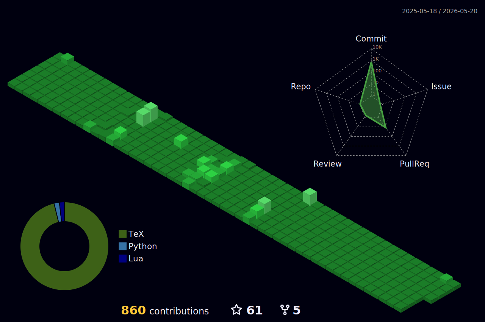

> THIS IS A WORK IN PROGRESS PROJECTS DATA SHOWN HERE MAY NOT BE AS ACURATE AS POSSIBLE
---

-
👋 Hi, I’m Sabbir Ahmed Shourov 👀 I’m interested in Python, Robotics, Artificial Intelligence & Dev-Ops. 🌱 I’m currently working as an R&D Engineer at ISTL. 💞️ I’m looking to collaborate on Robotics & Machine Learning Projects. 📫 Contact me at write2shourov@gmail.com

## Find me around the web 🌎: 
- Learning in public on <a href="https://www.twitch.tv/blacktechdiva">Twitch</a> or <a href="https://www.monica.dev">monica.dev</a> 📹 ✍🏾
- Tinkering with interactions on <a href="https://codepen.io/m0nica"> Codepen</a> 🏓
- Sharing updates on <a href="https://www.linkedin.com/in/monicampowell/">LinkedIn</a> 💼

###

  
  
  

###

  

###

<h1 align="center">hey there 👋</h1>

###

<h3 align="left">👩‍💻  About Me</h3>

###

I'm ... from ....  - 🔭 I’m working as ... - 📚 I'm currently learning ... - ⚡ In my free time I ...

###

<h3 align="left">🛠 Language and tools</h3>

###

  
  
  
  
  
  
  
  
  
  
  
  
  
  
  
  
  

###

<h3 align="left">🔥   My Stats :</h3>

###

  

###

### Recent Blog posts
<!-- BLOG-POST-LIST:START -->
- [First POST](https://extinctcoder.github.io/posts/first-post/)
- [Getting Started](https://extinctcoder.github.io/posts/getting-started/)
<!-- BLOG-POST-LIST:END -->
i am working on it
<!-- START OF PROFILE STACK, DO NOT REMOVE -->
| 💻 **Technology** | 🚀 **Projects** |
| - | - |
|  |      |
|  |   |
<!-- END OF PROFILE STACK, DO NOT REMOVE -->
new section
### :zap: Recent Activity
<!--START_SECTION:activity-->
1. 💪 Opened PR [#3](https://github.com/holocron-lang/holocron-lsp/pull/3) in [holocron-lang/holocron-lsp](https://github.com/holocron-lang/holocron-lsp)
2. 💪 Opened PR [#14](https://github.com/holocron-lang/holocron/pull/14) in [holocron-lang/holocron](https://github.com/holocron-lang/holocron)
3. 🎉 Merged PR [#2](https://github.com/holocron-lang/homebrew-holocron/pull/2) in [holocron-lang/homebrew-holocron](https://github.com/holocron-lang/homebrew-holocron)
4. 🎉 Merged PR [#1](https://github.com/holocron-lang/homebrew-holocron/pull/1) in [holocron-lang/homebrew-holocron](https://github.com/holocron-lang/homebrew-holocron)
5. 💪 Opened PR [#2](https://github.com/holocron-lang/homebrew-holocron/pull/2) in [holocron-lang/homebrew-holocron](https://github.com/holocron-lang/homebrew-holocron)
<!--END_SECTION:activity-->